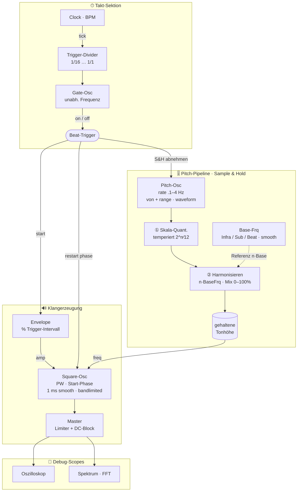
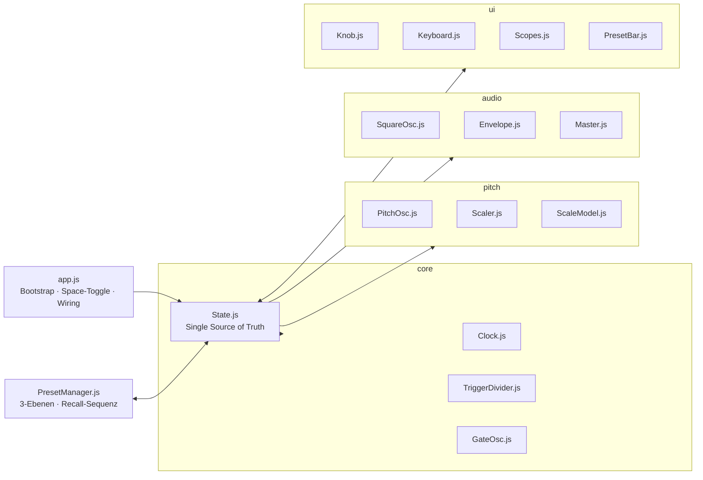

# Tesla-Coil-Oszillator — Konzept

> Modularer Web-Synth (Browser, Web Audio API, ES-Module) im Ordner `KI_html/teslacoil`.
> Eigenständig aufgebaut, lehnt sich an Bewährtes aus `KI_html/octaver` an (Knobs, Wavetable→PeriodicWave, Limiter).
> Ziel (Phase 1): **Browser-Audio** — ein normaler Synthese-Klangerzeuger. Der Name „Teslacoil" meint NUR
> das spätere Ziel: das fertige Audiosignal soll an eine Tesla-Coil gesendet werden. Es wird **keine
> Tesla-/Coil-Physik modelliert** — reine Klangsynthese. Echte Coil-Ansteuerung (Interrupter) ggf. Phase 2.
> Stand: 2026-06-27

---

## 1. Idee in einem Satz

Eine tempo-getaktete **Square-Wave mit Pulsweite**, die bei jedem Trigger **phasen-gesynct neu startet**,
deren **Tonhöhe pro Trigger** über ein Sample&Hold-System aus PitchOsc → Skala → Harmonisierung quantisiert
und gehalten wird, mit tempoabhängiger Hüllkurve und einem unabhängigen Gate für rhythmische Gebilde.
**„Kein Jaulen":** Tonhöhe ist pro Trigger fest; nur schmale Frequenz-Anpassungen durchs Harmonisieren sind erlaubt.

---

## 2. Signalfluss

---

## 3. Module im Detail

### 3.1 Clock
- Tempo in **BPM**. Master-Zeitbasis, sample-accurate via AudioContext-Zeit (Lookahead-Scheduler, kein `setInterval`-Jitter).
- Toggle **Start/Stop = Leertaste**.

### 3.2 Trigger-Divider
- Teilt die Clock in Triggerintervalle: **1/16 … 1/1** (1/16, 1/8, 1/4, 1/2, 1/1; evtl. Triolen/punktiert später).
- Liefert den **Beat-Trigger** — den zentralen Takt für S&H, Square-Restart und Envelope-Start.

### 3.3 Gate-Oszillator (rhythmische Gebilde)
- **Unabhängige Frequenz**, schaltet die Trigger an/aus → erzeugt Lücken/Muster.
- Bei „Gate aus" mitten im Ton: Envelope **sauber ausklingen** lassen (kein Hard-Cut → Knack).

### 3.4 Envelope
- Wird bei jedem Trigger gestartet.
- **Länge tempoabhängig**, als **% des aktuellen Triggerintervalls** (z.B. 50 % = halbe Note-Länge).
- **Pitch → Env-Länge** (Modulation): zwei Regler **P→Len tief** / **P→Len hoch** (%, 1…200, 100 = neutral/Mitte). Je nach Tonhöhe im Fenster [von…von+range] wird zwischen beiden interpoliert und auf `envPercent` multipliziert; das Ergebnis ist auf die **max. Step-Länge** (= volles Trigger-Intervall) gedeckelt. Default 100/100 → keine Wirkung.
- Form: mind. Attack/Decay (analog octaver). **Attack ab 0 erlaubt** (lineare Att-Kurve; 0 = senkrechter, „ungeglätteter" Einsatz — Knack-Risiko bewusst in Kauf genommen). Release bleibt kurz gerampt gegen Knacken.

### 3.5 PitchOsc (Bewegungsquelle der Tonhöhe)
- **Rate 0.1–4 Hz** (sehr langsam = die „Wanderung" der Tonhöhe).
- **Waveform** wählbar (sine / saw / „frei").
- Auslenkung definiert über **„von"** (= untere Tonhöhe als **freie absolute Frequenz** in Hz, Anzeige als Note **P** + **F** Hz) + **„Range" 1–36** (Halbtöne darüber).
  - Implementierung: Osc-Output -1..1 → **unipolar 0..1**, oszilliert als Halbton-Auslenkung über `von`; Tonhöhe = `von`-MIDI + Auslenkung.
  - Tonnamen sind **absolut** (A440): die zur Frequenz passende Note (55 Hz = A1, nicht C).
- Läuft **frei weiter**; nur der **beim Trigger abgenommene** Wert zählt (Sample & Hold) → diskrete Töne, kein Glide.

### 3.6 Skaler (zwei Stufen, in dieser Reihenfolge!)
1. **Skala-Quantizer** (temperiert, absolute Tonklassen): Der S&H-Wert (0..1) wird **gleichmäßig auf die aktiven Töne** des Fensters [von … von+range] verteilt — jeder Trigger trifft einen aktiven Ton, AUS-Tasten werden übersprungen (kein Rest durch die Skala; Pausen nur über den Gate-Osc). Sind **alle** Töne aus → Stille.
2. **Harmonisieren** auf BaseFrq: aktive Frequenz optional auf das nächste **ganzzahlige Vielfache `n · BaseFrq`** ziehen.
   - **Mix/IO-Regler 0…100 %**: stufenloses Überblenden „rein temperiert" ↔ „voll harmonisiert".
   - **BaseFrq ist von der Tonhöhe unabhängig, aber stets `≤ von`** (`min(baseHz, von)`) und darf tief gehen (Subbass/Infra) → echte Grundfrequenz statt nur erster Obertöne.
   - **BaseFrq-Quelle wählbar** (Select):
     1. **Freq** – freier Hz-Regler (wie bisher).
     2. **Tempo** – abgeleitet aus BPM (`bpm/60` = Beat-Frequenz in Hz).
     3. **Ton** – Tonklasse (C…B) + Oktav-Regler (0…−6, Referenz C2 bei 0); **fernsteuerbar per Pfeiltasten** (←/→ = Ton, ↑/↓ = Oktave; nur wenn kein Feld/Regler fokussiert). MIDI später.
   - Live-Readout der effektiven BaseFrq (Note · Hz) in der Skaler-Gruppe.
- Ergebnis wird an den Square-Osc übergeben und **gehalten** bis zum nächsten Trigger.

### 3.7 Audio-Oszillator (der eigentliche Tonerzeuger)
- **Zwei Engines** (Umschalter `oscEngine`), Fourier-Koeffizienten in `pulseWave.js → oscCoefficients`:
  - **Square-PW** – Pulswelle, **PW** = Tastverhältnis (Pulsweite). Analytisch, beliebig viele Obertöne.
  - **Sine-FM** – selbst-FM-rückkoppelnder Sinus (DX-/C15-artig): `y = sin(2π·ph + β·y₋₁)`, Regler **FM** = Feedback 0→1 (Sinus → sägezahn-artig). Für festen Feedback-Wert eine statische Welle → per **FFT-Re-Baking** (`fmCoefficients`) gebacken.
- **Start-Phase einstellbar**, beim Trigger **neu gesynct** (definierter Einschwingpunkt).
- **~1 ms Smoothing** an den Flanken/beim Restart gegen Knacken.
- **Bandlimited** über `PeriodicWave` → kein Aliasing bei hohen Frequenzen. Welle = gebackene Wavetable.
- **Obertonzahl frequenzabhängig (Mip-Map-Prinzip)**: hohe Cap (2048) → tiefe Töne (Sub/Infra) behalten **scharfe Ecken**, hohe Töne werden automatisch bandlimitiert. Gebackene Wavetables werden **gecacht** (quantisierte engine/param/phase/N) → CPU-sparsam bei ruhenden Reglern.
- **Aufgehoben für später**: die **Phase-Distortion-Engine** (Warp-Lesekopf `y = x^k` auf saw/sine/tri) ist NICHT gelöscht — `pulseWave.js → phaseWarp` + `warpedCoefficients` (samt Tests) bleiben vorhanden. Reaktivieren = `oscEngine`-Option ergänzen + in `oscCoefficients` auf `warpedCoefficients` dispatchen. (Auf Wunsch vorerst aus dem OSC genommen, Klang gefiel aber.)

### 3.8 Filter (resonanter Multipol-Tiefpass, TPT)
- **TPT/Zero-Delay-Feedback** nach V. Zavalishin („VA Filter Design") — **echte** Steilheits-Abstufung, kein Biquad-Notbehelf:
  - **1p** = ein 1-Pol-TPT (6 dB/Oct, ohne Resonanz)
  - **2p** = 2-Pol-TPT-**SVF** (12 dB/Oct, **Resonanz**)
  - **3p / 4p** = SVF + 1 bzw. 2 serielle 1-Pol-Stufen (18 / 24 dB/Oct)
  - Resonanz steckt im SVF → wirkt wie gewünscht **ab 2p** (UI blendet den Reso-Regler bei 1p aus).
- **Global im Bus** (nicht pro Voice) als **AudioWorklet** (`ladder-worklet.js`, eigener Audio-Thread); DSP-Referenz + Tests in `js/dsp/ladderCore.js`.
- **Decay-Hüllkurve** auf den Cutoff: **Env 0 = bis Cutoff, Env 1 = bis Maximum (≈18 kHz)** — exponentiell interpoliert, also bei voller Env immer bis ganz oben, egal wie tief der Cutoff steht. Fällt in der **Decay**-Zeit zurück. Getriggert von **Takt×Gate** (auf den `cutoff`-AudioParam geschedult).

### 3.9 Distortion (Effekt-Slot)
- `WaveShaperNode` mit **4× Oversampling** (gegen Alias). Umschalter `[Bypass | Saturation (tanh) | Hard Clip | Foldback]`.
- **Drive** (in die Kennlinie eingebacken) + **Out** (Ausgangspegel). Insert VOR dem Reverb.

### 3.10 Gate-Reverb (Effekt-Slot)
- **Effekt-Umschalter** `[Bypass, Gate Reverb, …]` (= IO) — Slot, weitere Effekte später möglich.
- **Gated Reverb** über `ConvolverNode` mit synthetischer Impulsantwort, die nach `Len` **hart abreißt** (gated).
  - **Density** – Dichte der Reflexionen ; **Release** – Ausfade-**Anteil** am Ende (0 = flaches Gate/harter Abriss, 1 = Decay über die ganze Länge)
  - **Len** – Länge **relativ zum Trigger-Intervall** (0…200 %) → tempo-synchron
  - **Lowpass** – Tiefpass auf dem Hall-Anteil ; **Dry/Wet** + **Wet-Vol** (bis 4× „Gas geben") ; **Seed** (fester RNG → reproduzierbare Wolke)
  - **Reflections-Anzeige**: Canvas (senkrechte Striche pro Reflexion, Höhe = Pegel, niedriges Alpha → dichte Wolken kräftiger), Umschalter `[L | R | Beide]`.
- **Pegel-Regler** (Dry/Wet, Wet-Vol, Lowpass) ändern die IR **nicht neu** → unterbrechungsfrei bedienbar; nur Density/Len/Release/Seed (und Tempo) lösen ein Rebuild aus.
- Insert im Bus: `… → Ladder → Distortion → Gate-Reverb → Master` (Dry durch, Wet zugemischt).
- **Ausblick „Envelope-Rev"**: Reflections-Sammlung später editierbar (Attack/Release/Beule) → dann kein reines Gate mehr.

### 3.11 Master
- **Limiter** (DynamicsCompressor wie octaver) + **DC-Block** (Highpass ~5–10 Hz) — bei Square/PW wichtig.

### 3.12 Debug-Scopes (aus `Documents/Musik/AI/scope-spektrum-demo.html` übernehmen)
- **Oszilloskop** (Zeitbereich, zoombar bis Einzel-Samples) + **Spektrum** (FFT). Direkt am Master-Analyser (fftSize 8192).
- **Trigger-Sync** (an/abschaltbar): rastet auf die nächste **steigende Nullflanke** ein → stehendes Bild.
- **Zeit-Range logarithmisch**: 16 Samples … volles Fenster (~186 ms @44.1k), mit ms-Readout.
- **Spektrum mit log-Frequenzachse** (ab ~10 Hz) → Sub/Infra-Bässe aufgefächert sichtbar.
- **Spektrum-Eingang wählbar**: Synth-Master ODER ein Audio-Eingang/**Mikrofon** (z.B. um eine physische Tesla-Coil zu vergleichen) + eigener **Anzeige-Pegel** (×0.1…8). Mikro-Spektrum grün, Master orange.

---

## 4. Frequenz-Update-Strategie (CPU-bewusst)

- Alle Frequenzen (BaseFrq, PitchOsc, gehaltene Tonhöhe) müssen **laufend** updatebar sein — auch **smooth innerhalb** eines Triggers (BaseFrq „surft" hörbar).
- Es geht aber nur um **eine** hörbare Frequenz → kein teurer Pro-Sample-Aufwand nötig.
- **Einstellbare Update-Rate 5–120 Hz** für die Parameter-Glättung (Control-Rate-Loop), entkoppelt von der Audio-Rate.
- Ziel: rund klingend, ohne CPU zu verbrennen. Glättung via `setTargetAtTime`/Ramps statt harter Sprünge.

---

## 5. UI

**Panel nach thematischen Gebieten** (nicht nur Knobs, sondern ALLE zugehörigen Controls je Gruppe):
- **Takt**: Teilung (Select) + Tempo.
- **Gate**: Gate-aktiv (Toggle) + Gate-Rate + Gate-Weite.
- **Skaler**: Pitch-Wave (Select) + Pitch-Osc (Rate/Von/Range) + **ON/OFF-Keyboard** + **Skala-Preset** (laden/sichern).
- **Base-Frq** (eigene Gruppe): BaseFrq-Quelle (Select) + Harmonize + **modusabhängige** Controls:
  - *Freq*: Base-Frq (Hz) sichtbar; zeigt zusätzlich die zusammenhängenden Speed-Werte **BpM** (0.001…999, sonst `..`/`zu hoch`), **Hz** und **P** (auch außerhalb 0–127).
  - *Tempo*: eigene **Oktave** −4…4 (Verdopplung/Halbierung der Beat-Frequenz); Ton/Base-Frq inaktiv.
  - *Ton*: Tonklasse + eigene **Oktave**; Base-Frq inaktiv.
- **Audio-Osz**: Engine-Schalter `[Square-PW | Sine-FM]` + **PW** (Square-PW) bzw. **FM**-Feedback (Sine-FM, je nach Engine sichtbar). (Start-Phase entfernt.)
- **Distortion**: `[Bypass | Saturation | Hard Clip | Foldback]` + Drive + Out.
- **Filter**: Pole (Aus/1p…4p, Select) + Cutoff + Reso (erst ab 2p sichtbar) + Env + Decay. Resonanter TPT-Multipol-Tiefpass (AudioWorklet) im Bus, Decay-Hüllkurve pro Trigger (Takt×Gate).
- **Envelope**: Attack + Amp + **Länge %** mit zwei kleinen **Satelliten-Reglern** P→Len tief/hoch.
- **Gate Reverb**: Effekt-Umschalter `[Bypass, Gate Reverb, …]` + Density/Len/Release/Lowpass (Regler nur sichtbar, wenn ein Effekt aktiv ist).
- **Master** (global, flach **oben** in der Transport-Zeile): Volume-Slider + DC-Block (Toggle).
- **Global oben**: Transport (Start) + Ensemble-Snapshot (Recall/Speichern/Export) + Master.

**Gruppen-Chrome** (im Snapshot persistiert: `groupOrder`, `groupStyles`, `groupStylePresets`):
- **Verschiebbar** per Drag an der Titelleiste (Reihenfolge frei).
- **Ein-/Ausklapp-Button** (▾/▸) in jeder Titelleiste.
- **Gruppen-Settings** (⚙): Name, BG-Farbe, Headline-Farbe (je mit Alpha); als **Combo** speicherbar und auf andere Gruppen anwendbar.
- **Scopes** (Oszilloskop/Spektrum) je per Checkbox **abschaltbar** (spart CPU).

- **Knobs aus octaver wiederverwenden** (`js/ui/Knob.js`) — SVG-Drehregler mit log/exp/linear-Kurven, Doppelklick-Eingabe, Meta-Editor. Waren gut.
  - **Selektion per Klick** auf den Anzeigewert → Regler bekommt Fokus (sichtbar hervorgehoben), dann **Pfeiltasten** feinjustieren: ⇧ grob (×10) · ⌥ fein (÷10) · ⌘/Ctrl extra-fein (÷100). Doppelklick = direkte Werteingabe.
- **12-Ton-Keyboard** (Skala-Editor):
  - Eine Oktave, **schwarz/weiße Tasten in gleicher Breite**.
  - Jede Taste: **deutliche An/Aus-Anzeige**, ohne den Tasten-Hintergrund komplett zu ersetzen (aktiv = heller, Taste bleibt erahnbar).
  - Darüber: laufende Anzeige der **aktuell aktiven (oktavierten) BaseFrq/Tonhöhe**, die „durchsurft" — smooth animiert; zeigt zur Frequenz den passenden Ton.
  - **Sub-Presets + Shortcuts** zum Speichern/Abrufen von **Skalen** (12-Button-Muster).

---

## 6. Preset-System (3 Ebenen) — HEIKEL, sorgfältig bauen

> Lehre aus NI Reaktor: Recall ist die Bruchstelle. Reihenfolge & Timing müssen stimmen.

| Ebene | Inhalt | Scope |
|-------|--------|-------|
| **Skalen-Presets** | 12-Button-Muster | nur Keyboard |
| **Control-Presets** | einzelne Modul-/Regler-Sets | je Modul |
| **Ensemble-Snapshot** | **ALLE** aktuellen Einstellungen | global, unabhängig von den anderen beiden |

### Recall-Disziplin (Pflicht)
1. **Single Source of Truth**: Ein zentrales State-Objekt. UI **und** Audio-Engine lesen/schreiben dasselbe. Kein doppelter Wahrheitsbesitz.
2. **Recall = State setzen → UI *und* Engine neu binden.**
   ⚠️ **octaver-Bug, den wir vermeiden:** dort ruft `SnapshotManager.loadSnapshot()` nur `engine.loadFromJSON()` — die **Knobs werden nie aktualisiert**, zeigen ihre alten Werte. → Hier muss Recall **jeden Regler** aus dem State neu setzen (`knob.value = state…`).
3. **Recall-Sequenz, „alles zur rechten Zeit":**
   `Stop/Pause Clock → State laden → Defaults für fehlende Felder → Module rekonstruieren → UI binden → Engine binden → Clock/Trigger neu starten.`
4. **Default-Werte** für jedes Feld definieren (fehlt ein Feld im alten Snapshot → sauberer Fallback, kein `undefined`/Knack).
5. **Versionierung** im Snapshot (`version`) für spätere Migration.

---

## 7. Architektur (geplante Module)

---

## 8. Offen gelassen / später (Stichworte zum Ausformulieren)

- **Triolen/punktierte Teilungen** im Trigger-Divider (über die geraden 1/n hinaus).
- **BaseFrq-Quelle**: reine Infra-Frequenz *oder* als rhythmischer „Beat"/Subbass — wie umschalten, woher.
- **PitchOsc „frei"-Waveform**: was genau (interner Random/S&H? Custom-Curve? gezeichnet?).
- **Echte Coil-Ansteuerung (Phase 2)**: Interrupter-Logik, Pulsweite = Leistung, evtl. feste Trägerfrequenz.
- „evtl. baue ich noch etwas dazu" — System auf laufende Pitch-Updates vorbereitet halten.
- **Control-Presets im Edit-Fenster** (später): pro Regler-Edit-Fenster kleine Presets speichern. Jedes Preset kennt seine **Herkunft** (von welchem Control) und wird bei allen **ähnlichen** Controls zum **parallelen Laden** angeboten (mit Herkunfts-Hinweis); optional **Stichwortsuche**.

---

## 9. Begriffe (Glossar)

Damit Konzept, UI und Code dieselbe Sprache sprechen:

| Begriff | Bedeutung |
|---------|-----------|
| **Panel** | Die gesamte Bedienoberfläche (UI) des Instruments — alle Gruppen zusammen. |
| **Control** | Ein einzelnes, anpassbares Eingabe-Element (Knob, Select, Toggle, Slider, Keyboard-Taste). |
| **Gruppe** | Thematische Gruppierung von Panel-Elementen (z.B. *Takt*, *Gate*, *Base-Frq*, *Audio-Osz*, *Filter*, *Envelope*). |
| **Snapshot** | **Alle** aktuellen Einstellungen zusammen (Ensemble) — das vollständige Klangbild, global gespeichert/abrufbar. |
| **Preset** | Einzelne Control-/Teil-Einstellung(en) — kleinerer Umfang als ein Snapshot (z.B. ein Skala-Preset oder später Control-Presets pro Regler). |

> Abgrenzung **Snapshot ↔ Preset**: Snapshot = *das ganze Instrument*, Preset = *ein Ausschnitt* (eine Skala, ein Regler-Set).

---

## 10. Erledigt (Build-Fortschritt)

- **Regler-Meta persistiert**: Range/Kurve/Einheit aus dem Edit-Fenster (⚙) werden im State gehalten und im Ensemble-Snapshot mitgespeichert → Recall stellt auch geänderte Reglerskalen wieder her. „Zurücksetzen" geht auf die Original-Definition zurück.
- **Keyboard-Aktivmarker**: inset-Rahmen + weicher Halo (gewollter Effekt, strahlt sanft auf Nachbarn). ON-Opazität erhöht. Maus-Klick hinterlässt keinen Fokusring (Tastatur-Fokus bleibt).
