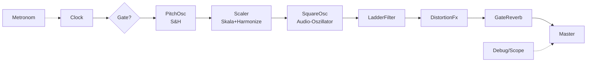

# ⚡ Teslacoil – Ein getakteter Puls-Synth für den Browser

> **Musik mit KI selber bauen** – Von der Tesla-Spule zum modularen Web-Audio-Synth

---

## 🌩️ Die Geschichte

Teslacoil begann als experimentelles Projekt: Eine echte **Tesla-Coil** (Hochfrequenz-Transformator), die bei hohen Tönen laute Funken schlägt. Der ursprüngliche Plan war einfach – einen Sound einspielen und die physikalische Reaktion der Spule musikalisch nutzen.

Das funktionierte hervorragend. Es entstand sogar ein Video davon. Aber die Tesla-Spule ist ein sehr lautes, "solistisches" Instrument. Über **Lautsprecher** wurde das System vielseitiger – und plötzlich konnten Ideen und Wünschen freierer Lauf gegeben werden.

Aus dem physikalischen Experiment wurde ein **vollständiger Browser-Synth** – modular, getaktet, und mit einer eigenen musikalischen Philosophie.

---

## 🎵 Die Vision: Jenseits der temperierten Stimmung

> *"Mein Traum ist es, die Frequenzen zueinander anders ordnen zu können."*

Die üblichen **temperierten Akkorde** wirken abgedroschen – nicht weil sie uninteressant wären, sondern weil sie zu wenig **Stimmungsfreiheit** bieten. Die 12-Ton-Teilung ist für den Bereich 40 Hz bis ~5 kHz hervorragend, aber die gleichstufige Temperatur ist eine unfreie Einstellung.

**Harmonisch** bedeutet hier: Bei Höhepunkten oder aneinander reibenden Obertongeflechten – genau das ist das Magische, wie etwa bei *Angine de Poitrine*.

Der **Skalar** in Teslacoil ist der erste Schritt in diese Richtung: Frequenzen können anders zueinander geordnet werden, über Skalen, Harmonisierung und den Traum von echter Stimmungsfreiheit.

---

## 🎛️ Das Konzept

Teslacoil ist ein **getakteter Puls-Synth** im Browser. Bei jedem Takt-Tick fällt ein Ton – gefiltert, verzerrt, verhallt. Kein Installieren, kein Speichern-Zwang. Alles läuft im Browser und merkt sich selbst, wo du aufgehört hast.

### Signalfluss



### Kern-Features

- **Clock-getriggert** – Metronom mit freiem l/m-Verhältnis (nicht nur 2er-Potenzen)
- **Scaler** – 12-Ton-Skala mit Anker-Funktion, Skal2-Presets, Harmonisierung auf Base-Frequenz
- **Oszillatoren** – Square mit Phasen-Distortion, Sine mit FM-Feedback (von Sine zu "saw"-ähnlich)
- **Filter** – Vadims Ladder-Filter (LP/BP/HP), polyphon oder monophon mit KeyTrack
- **Effekte** – Distortion (Hard/Soft Clip, etc.), Gate Reverb mit sichtbaren Reflections
- **Sequenzer** – Für Filter-Env und Amp mit variabler Länge, Fill-Funktion
- **Snapshots** – Sound, Optik und Skala in **drei unabhängigen Ebenen**
- **Layout** – Gruppen und Controls frei anordbar (e-Mode), per Rechtsklick konfigurierbar

---

## 🛠️ Technische Umsetzung

### Architektur

- **Reines ES-Modul-JS** – Kein Build-Step, läuft direkt im Browser
- **Web Audio API** – Alle DSP-Module nutzen den AudioContext
- **Single Source of Truth** – Der `State` in [js/core/State.js](js/core/State.js) ist zentral
- **UI** – Generisch aufgebaut aus `KNOBS`, `SELECTS`, `TOGGLES`, `GROUPS`
- **Audio Engine** – [js/engine/TeslaEngine.js](js/engine/TeslaEngine.js) verdrahtet die Module

### Dateistruktur

```
teslacoil/
├── js/
│   ├── app.js                    # UI-Aufbau, bidirektionale Binding
│   ├── core/                     # State, Clock, keyRoute
│   ├── engine/                   # TeslaEngine (Audio-Verdrahtung)
│   ├── audio/                    # LadderFilter, DistortionFx, GateReverb...
│   ├── dsp/                      # Reine DSP-Logik (filterMod, stepSeq...)
│   ├── pitch/                    # Scaler, ScaleModel, PitchOsc
│   ├── ui/                       # Knob, Keyboard, Scopes, StepSeqUI
│   └── data/                     # PresetManager, Backup
├── css/main.css                  # Dark-Theme, Knob/Fader-Optik
├── index.html                    # Einstiegspunkt
├── test/                         # Logic-Tests (111+), Playwright-Integration
└── docs/                         # Planung, Konzepte, Reviews
```

### Tests

- **111+ Logic-Tests** – Headless in [test/logic.test.mjs](test/logic.test.mjs)
- **Integration** – [test/smoke.py](test/smoke.py) (lädt, Audio erzeugt Signal)
- **Performance** – [test/perf.py](test/perf.py) (≥45 FPS Render-Loop)
- **Tastatur** – [test/arrange.py](test/arrange.py) (e-Mode, keyRoute)

---

## 🎮 Bedienung

### Starten

1. Lokalen Server starten: `python3 -m http.server 8000`
2. Browser öffnen: <http://localhost:8000/>
3. **Leertaste** drücken – Start/Stop, überall, jederzeit

### Controls

- **Drag** – Regler hoch/runter ziehen
- **Doppelklick** auf Wert – Direkteingabe
- **Rechtsklick** – Settings (Farbe, Größe, Label-Position, Fader-Länge...)
- **Tab** – Durch Controls navigieren
- **Space** – Start/Stop (immer, auch bei Fokus)
- **'e'** – e-Mode (freies Anordnen)

### Snapshots

- **＋ speichern** – Springt direkt auf neuen Snapshot
- **Derselbe Snapshot wählen** – Stellt ihn wieder her (mit `↻`-Anzeige)
- **Drei Ebenen** – Sound (Snapshot), Optik (Layout), Skala (Preset) – unabhängig

---

## 📚 Weiterführende Dokumente

- **[anleitung.md](anleitung.md)** – Schritt-für-Schritt-Bedienungsanleitung
- **[howto.md](howto.md)** – Technische Details zum Starten
- **[CLAUDE.md](CLAUDE.md)** – Projekt-Kontext für KI-Chats
- **[dd.md](dd.md)** – Chronologische Prompt-Historie (1300+ Zeilen!)

---

## 🚀 Ausblick

Teslacoil ist lebendige Entwicklung. Die Vision von **Stimmungsfreiheit** jenseits der temperierten Stimmung ist ein langer Weg – der Skalar ist der erste Schritt.

**Werkbank** – Ein Ort, um Gruppen zu bauen und zu verfeinern.
**Debug** – Audio-Aufnahme, Screenshot, geteilte Debug-Sessions.
**MIDI** – Fernsteuerung von Skala, Base-Freq, Snapshots.
**Export** – WAV-Export von Snapshots, Audio-Tables.

---

## 👨‍💻 Entwickelt mit KI

Teslacoil wurde **komplett per Prompt** mit verschiedenen KI-Modellen entwickelt – von der ersten Idee bis zum modularen Synth. Die gesamte Entwicklungsgeschichte steht in [dd.md](dd.md) – über 1300 Zeilen an Prompts, Fixes, Tests und Commits.

**Modelle im Einsatz:** Claude Opus 4.8, Sonnet, DeepSeek, Qwen 3.5

**Git-Repo:** [github.com/3Dietrich/teslacoil](https://github.com/3Dietrich/teslacoil)

---

*Letzte Aktualisierung: 2026-07-15*  
*by DD mit Claude Code*
