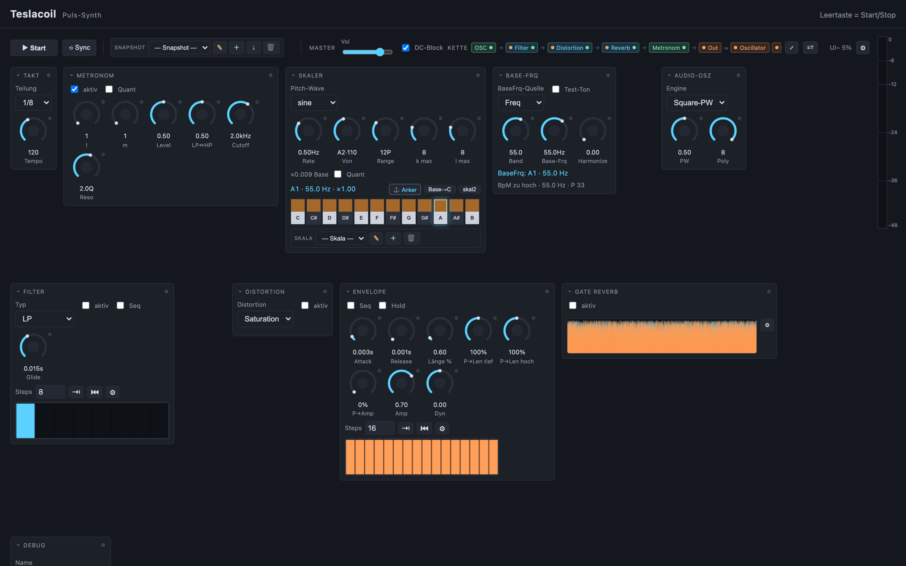
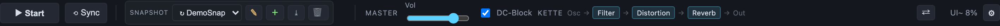
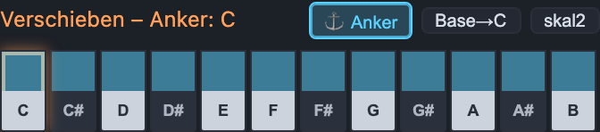
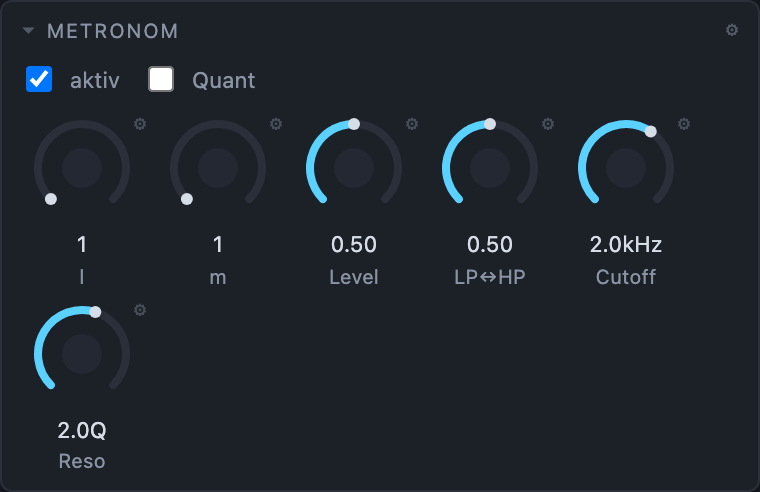
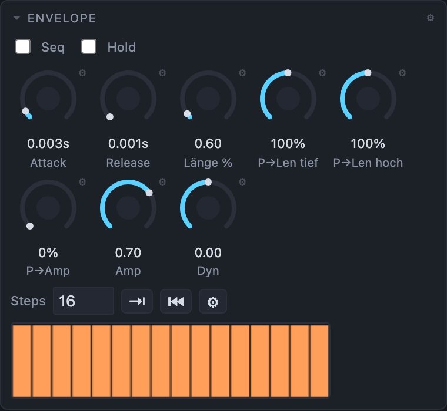
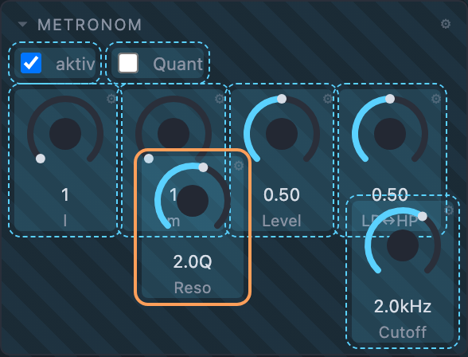

# ⚡ Teslacoil – die (fast) unterhaltsame Anleitung

Willkommen an der Blitzmaschine. Teslacoil ist ein **getakteter Puls-Synth** im Browser:
eine Uhr tickt, bei jedem Tick fällt ein Ton – gefiltert, verzerrt, verhallt. Kein
Installieren, kein Speichern-Zwang, alles läuft im Browser und merkt sich selbst,
wo du aufgehört hast.

> Starten: lokalen Server anwerfen (`python3 -m http.server 8000`) und
> <http://localhost:8000/> öffnen. Details stehen in [howto.md](howto.md).

---

## 1. Der erste Ton (Zaubertaste: Leertaste)

Drück **Leertaste**. Das ist Start/Stop – überall, jederzeit, egal wo die Maus steht.
(Falls mal ein Schalter im Fokus klebt und Space stattdessen ihn umschaltet: einmal
**Esc**, dann ist Space wieder brav der Transport.)

Regler bedienst du wie ein Mischpult: **anfassen und hoch/runter ziehen**. Doppelklick
auf den Zahlenwert = direkt eintippen. Das kleine ⚙ am Regler öffnet Range, Kurve und
Farbe.

---

## 2. Snapshots – jetzt mit Gedächtnis und Wiederhol-Knopf

Ein **Snapshot** friert *alle* Klang-Parameter ein (die Optik bleibt außen vor, die lebt
getrennt). Zwei Dinge sind neu und machen den Alltag angenehmer:

- **＋ speichern springt direkt auf den neuen Snapshot.** Kein Suchen mehr im Menü –
  du speicherst „AbfahrtsHall" und stehst sofort drauf.
- **Denselben Snapshot nochmal wählen stellt ihn wieder her.** Der geladene Name steht
  als `↻ Name` im Menü (siehe unten: `↻ DemoSnap`). Du hast rumgeschraubt, es klingt
  nach Katzenjammer? Einfach denselben Eintrag nochmal anklicken → alles wie gespeichert.
  Das kleine `*` daneben verrät dir vorher, dass du überhaupt etwas verändert hast
  (`‼` = kräftig verändert).

Dasselbe Wiederhol-Verhalten gilt für **Skala, P2, Combo und die Gruppen-Snapshots** –
überall lädt „nochmal dasselbe wählen" neu.

---

## 3. Skaler & der neue Anker-Schalter

Der Skaler baut aus einer zufälligen/rampenden Tonhöhenquelle echte Töne auf einer Skala.
Das **Keyboard** ist dein Skala-Editor: obere Reihe = Ton an/aus.

Neu: der **Anker** ist jetzt ein eigener, **bläulicher Schalter** links neben `Base→C`
(früher musstest du dafür heimlich auf die Frequenzanzeige klicken). Ist er an, färbt
sich die **obere Reihe blau** – du siehst also sofort: *Achtung, jetzt verschiebe ich die
ganze Skala auf der Frequenzachse* statt einzelne Töne zu schalten. Klick auf einen Ton
zieht die komplette Skala dorthin, das Muster wandert mit.

---

## 4. Metronom: von starren Teilungen zu freiem l ⁄ m

Früher gab's fürs Metronom nur die üblichen Zweierpotenzen (1/1, 1/2, 1/4 …). Jetzt
bestimmst du die Klick-Periode als **freies Verhältnis l ⁄ m** mit zwei Reglern
(je ganzzahlig 1–16):

> **Klick-Periode = ein Viertel × (l ⁄ m)**

`l=1, m=1` ist das gute alte Viertel. `l=1, m=3` gibt dir triolische Klicks, `l=3, m=2`
etwas Punktiertes, `l=7, m=4` … na ja, viel Spaß beim Zählen. 🥁

---

## 5. Envelope: Länge & P→Len sind erwachsen geworden

Die drei Längen-Regler saßen bisher als winzige Satelliten-Untergruppe an der „Länge".
Diese Untergruppe ist **aufgelöst** – **Länge %**, **P→Len tief** und **P→Len hoch** sind
jetzt ganz normale, vollwertige Regler in der Reihe. Besser zu treffen, besser zu
verschieben (siehe nächster Punkt).

---

## 6. e-Mode: alles frei anordnen (das Lieblingsspielzeug)

Taste **`e`** (oder der ⇄-Knopf oben rechts) schaltet den **Anordnen-Modus**. Das Panel
schraffiert sich, Bedienung ist aus, jetzt wird *gebaut*:

- **Alles ist verschiebbar** – nicht nur Regler, sondern auch Selects, Schalter,
  **Step-Sequenzer, Keyboard, Anzeigen** … jede Einheit für sich.
- **Nicht mehr ultra-magnetisch.** Zieh frei herum – es rastet im **10-px-Raster** ein.
- **Shift = 1-px-Feintuning**, und der so gesetzte Offset **bleibt erhalten**, wenn du
  danach wieder im Raster schiebst (die Phase bleibt).
- **Klick wählt aus** (orange Markierung), dann bewegen die **Pfeiltasten** (Shift = 1 px).
- **Ganze Gruppen** ziehst du am Titel – gleiches Raster, Shift fein, Pfeiltasten.
- **Der Gruppen-Rahmen hugt den Inhalt:** sobald du in einer Gruppe etwas bewegst, wird
  sie zum freien Canvas – der Rahmen umschließt danach *exakt* die belegte Fläche
  (obere linke Ecke = Anker), kein Platz „bis sonstwohin" mehr. Und jedes Control ist
  nur so hoch wie sein Inhalt (ein Control „ohne Knob" endet direkt unter dem Label).

Nochmal `e` (oder Esc/⇄) und du bist zurück im Spielbetrieb. Deine Anordnung wird als
Optik automatisch gesichert.

---

## 7. Die Kette: eine kleine Patchbay

Oben in der Kopfzeile sitzt die **Kette**. Sie kennt jetzt drei Sorten Knoten:

- **Quellen** (grün, `out•`): **OSC** (fest, der Haupt-Ton) und **Metronom**.
- **Effekte** (blau, `•in`/`out•`): **Filter · Distortion · Reverb** – ziehen zum
  Umsortieren der Signalkette.
- **Ziele** (orange, `•in`): **Out** (Master) sowie **Oscillator · Spectrum · Debug**
  als Anzeigen/Abgriffe.

Das **Metronom** ist jetzt ein Ketten-Knoten: Wo du es hinziehst, dort speist es ein.
Vor dem Filter → es läuft durch alles; vor dem Reverb → nur noch Hall drauf; ganz hinten
(hinter allen Effekten) → **parallel** (trocken an den Master). Deshalb ist der alte
„Route"-Regler im Metronom weg – die Position *ist* die Route.

Wird's zu breit, scrollt die Zeile; der **⤢-Knopf** („alles zeigen") bricht sie
stattdessen um und zeigt alle Knoten auf einmal.

---

## 8. Gate-Reverb: Release-Form

Neuer Regler **Rel-Form (0–100 %)**: Bei 0 % ist der Release-Ausklang **linear** (wie
bisher), Richtung 100 % wird er **„logarithmisch" gefaked** – schneller Anfangs-Abfall
mit langem Schwanz. Gut für weichere Hall-Enden, ohne das Gate ganz aufzugeben.

---

## 🎛️ Spickzettel

| Taste / Geste | Wirkung |
|---|---|
| **Leertaste** | Start / Stop |
| **Esc** | Overlays zu, Fokus weg (Space wieder Transport) |
| **e** | Anordnen-Modus an/aus |
| **Regler ziehen** | Wert ändern · Doppelklick = eintippen · ⚙ = Range/Farbe |
| **↑ / ↓** (normal) | Base-Frq oktavweise |
| **← / →** (Ton-Modus) | Base-Tonklasse |
| **Pfeiltasten** (e-Mode, Auswahl) | Element im 10-px-Raster schieben (Shift = 1 px) |
| **Snapshot nochmal wählen** | gespeicherten Stand wiederherstellen |

Viel Spaß – und nicht die Finger an die echte Spule. ⚡
