# ⚡ Teslacoil – Anleitung

Teslacoil ist ein **getakteter Synth** im Browser. Eine Uhr tickt; bei jedem Tick wird
eine Tonhöhe abgegriffen, auf eine Skala gezogen und ausgegeben – gefiltert, verzerrt,
verhallt. Angefangen hat er als reiner Puls-Synth; inzwischen hat er **zwei
Oszillatoren**: den Puls mit einstellbarer Pulsweite und einen **Sine-FM**, der über
sein Feedback vom reinen Sinus über den Sägezahn bis in einen obertonreichen Ton läuft.

Kein Installieren, kein Speichern-Zwang: der Zustand wird laufend gesichert und beim
nächsten Öffnen wiederhergestellt.

Online: <https://3dietrich.github.io/teslacoil/> · lokal: [howto.md](howto.md).

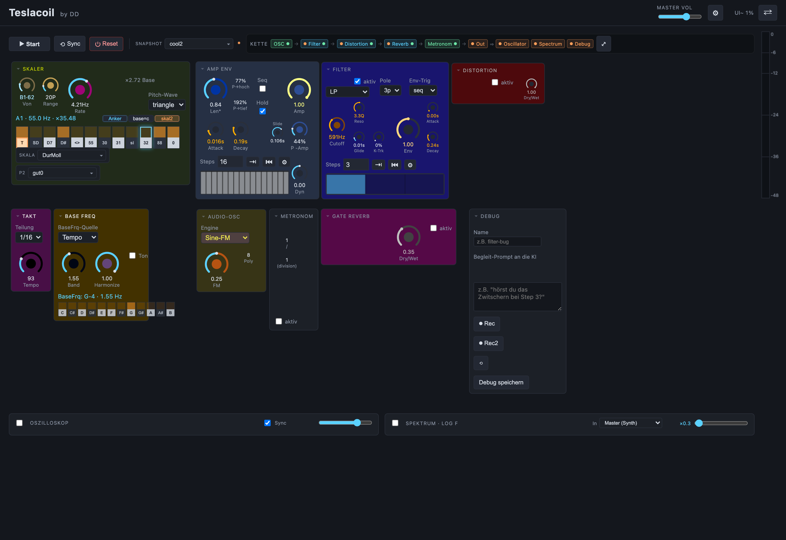

---

## Inhalt

- [⚡ Teslacoil – Anleitung](#-teslacoil--anleitung)
  - [Inhalt](#inhalt)
  - [1. Wie der Ton entsteht](#1-wie-der-ton-entsteht)
  - [2. Bedienen: Regler, Schalter, Menüs](#2-bedienen-regler-schalter-menüs)
  - [3. Kopfzeile](#3-kopfzeile)
  - [4. Transportzeile](#4-transportzeile)
  - [5. Die Kette](#5-die-kette)
  - [6. Die Gruppen](#6-die-gruppen)
    - [Takt](#takt)
    - [Metronom](#metronom)
    - [Skaler](#skaler)
    - [Base-Frq](#base-frq)
    - [Audio-Osz](#audio-osz)
    - [Filter](#filter)
    - [Distortion](#distortion)
    - [Envelope](#envelope)
    - [Gate Reverb](#gate-reverb)
    - [Debug](#debug)
  - [7. Anzeigen](#7-anzeigen)
  - [8. Anordnen (e-Mode) und Optik](#8-anordnen-e-mode-und-optik)
  - [9. Speichern: Snapshot, Skala, P2, Optik, Backup](#9-speichern-snapshot-skala-p2-optik-backup)
    - [Einstellungen: Backups, Datei, Werkseinstellung](#einstellungen-backups-datei-werkseinstellung)
  - [10. Tastatur-Spickzettel](#10-tastatur-spickzettel)

---

## 1. Wie der Ton entsteht

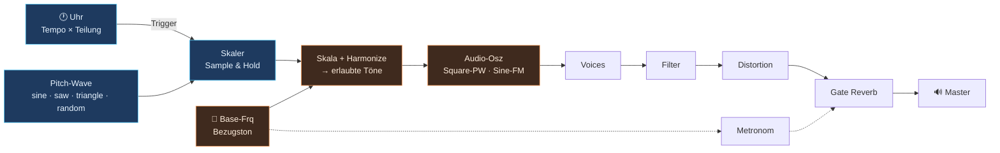

**Die Uhr gibt nicht nur den Takt vor, sondern auch die meisten Frequenzen.** Das ist
der Kern des Instruments: über **Oktavierung** und **ganzzahlige Vielfache** – also
Obertöne – wird aus derselben Uhr, die den Rhythmus macht, das Frequenzmaterial. Rhythmus
und Tonhöhe sind hier zwei Enden derselben Skala; man kann eine „Rate" so weit hochdrehen,
bis sie zum Ton wird.

Drei Dinge muss man auseinanderhalten:

- **Takt** bestimmt, *wann* ein Ton kommt (Tempo × Teilung).
- **Skaler** bestimmt, *welche* Tonhöhe kommt: eine langsam laufende Wellenform
  (Pitch-Wave) wird bei jedem Trigger abgetastet (Sample & Hold) und auf die
  erlaubten Töne der Skala gerundet.
- **Base-Frq** ist der Bezugston, auf den sich alles Frequenzführende beziehen kann.
  Gerundet wird auf die nächstliegende Frequenz `Basis × n` – also auf einen echten
  Oberton des tiefen Grundtons. Damit lassen sich **„schräge" Töne bauen, die trotzdem
  sicher harmonisch sind**: mit `Harmonize = 1` ist die Basis der gemeinsame Grundton
  für die meisten Bestandteile von Teslacoil, die eine Frequenz haben.

Die Reihenfolge der drei Effekte ist nicht fest – sie steht in der [Kette](#5-die-kette)
und ist per Drag umsteckbar. Auch das Metronom hängt dort, wo man es hinzieht.

---

## 2. Bedienen: Regler, Schalter, Menüs

| Element | Bedienung |
|---|---|
| **Regler** | anfassen und hoch/runter ziehen · **Doppelklick auf den Wert** = eintippen · **Rechtsklick** = Regler-Einstellungen |
| **Menü (Select)** | anklicken und wählen; bei Fokus schalten ↑/↓ durch die Optionen |
| **Schalter (Haken)** | Klick · am Label ziehen schaltet ebenfalls |
| **Texteingabe** | tippen; **Tab** hinein selektiert den ganzen Inhalt (überschreiben statt anhängen). Mehrzeilige Felder haben unten rechts einen Zipfel zum Aufziehen |
| **Gruppe** | Titel ziehen = verschieben · **▾** = ein-/ausklappen · **Rechtsklick** = Gruppen-Einstellungen |

**Tab** wandert im Kreis durch alle sichtbaren Bedienelemente eines Panels,
**Shift+Tab** rückwärts. **Esc** schließt Overlays, hebt eine Auswahl auf und gibt den
Fokus ab – danach ist die Leertaste garantiert wieder Start/Stop.

> **Die rechte Maustaste ist überall empfindlich.** Es gibt keine Zahnrädchen an den
> Bedienelementen – man muss nur wissen: was man sieht, hat Einstellungen, und man kommt
> per Rechtsklick daran. Regler, Menüs, Schalter, Texte, Buttons, Anzeigen, ganze Gruppen.

Bei Reglern öffnet sich der
Regler-Editor (Min, Max, Step, Kurve, Nachkommastellen, Skew, Einheit, Gestalt
Knob/Fader, Farbe – mit Kurven-Vorschau und wiederverwendbaren Farb-Presets):

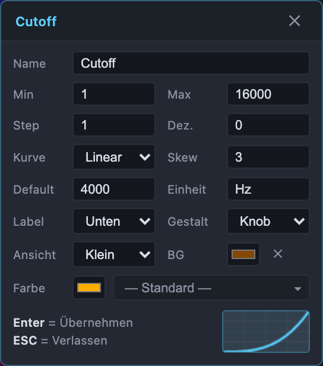

Bei allen anderen Elementen (Menüs, Schalter, Texte, Buttons, Anzeigen) öffnet sich das
Element-Panel mit Label, Label-Position/an-aus, Vorder-/Hintergrundfarbe, Schriftgröße
und Feldgröße. Diese Einstellungen sind **rein optisch** – sie verstellen nie einen Wert.

---

## 3. Kopfzeile

| Element | Wirkung |
|---|---|
| **Master Vol** | Gesamtlautstärke (0–1) |
| **⚙** | [Einstellungen](#einstellungen-backups-datei-werkseinstellung): Backups, Datei-Zugang, Werkseinstellung |
| **CPU / UI~** | Audio-Render-Last des AudioContext. Nur Chrome misst echt; sonst steht dort `UI~` und eine grobe UI-Last |
| **⇄** | [Anordnen-Modus](#8-anordnen-e-mode-und-optik) (dasselbe wie die Taste **e**) |

---

## 4. Transportzeile

| Element | Wirkung |
|---|---|
| **▶ Start / ■ Stop** | Transport. Kürzel: **Leertaste** |
| **⟲ Sync** | Wenn an, beginnen bei jedem Start alle Sequenzer wieder bei Step 1 |
| **⏻ Reset** | Audio-Panik: würgt Töne, Filter- und Hall-Fahnen sofort ab. Knackt hörbar – nur nötig, wenn nach dem Stop etwas hängt |
| **Snapshot** | Klang-Speicher, siehe [Speichern](#9-speichern-snapshot-skala-p2-optik-backup) |
| **`*` / `‼`** | Dirty-Marker: der aktuelle Zustand weicht vom geladenen Snapshot ab (`‼` = über 60 % der Parameter) |
| **Kette** | Signalweg, siehe unten |

Rechts an der Fensterkante steht das **Ausgangs-Pegelmeter** (dBFS, Peak-Hold, Skala
0 bis −48 dB).

---

## 5. Die Kette

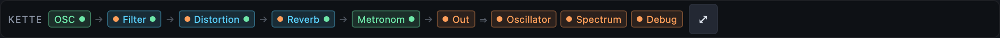

Die Kette ist die Patchbay des Instruments. Sie kennt drei Sorten Knoten:

- **Quellen** (grün, mit `out•`): **OSC** – der Haupt-Ton, fest am Kopf – und **Metronom**.
- **Effekte** (blau, `•in`/`out•`): **Filter · Distortion · Reverb**. Ziehen sortiert sie um;
  die Reihenfolge in der Zeile *ist* die Signalkette.
- **Ziele** (orange, `•in`): **Out** (Master) sowie die Abgriffe **Oscillator · Spectrum ·
  Debug** – sie zeigen/greifen ab, was am Master ankommt.

Das **Metronom** ist selbst ein Knoten: wo es steht, dort speist es ein. Vor dem Filter →
es läuft durch alles. Vor dem Reverb → es bekommt nur noch Hall. Hinter allen Effekten →
es geht trocken und parallel an den Master. Einen eigenen „Route"-Regler braucht es
deshalb nicht.

Wird die Zeile zu breit, scrollt sie. **⤢** bricht sie stattdessen um und zeigt alle
Knoten auf einmal.

---

## 6. Die Gruppen

Jede Gruppe ist ein thematisches Gebiet und enthält alle zugehörigen Bedienelemente.
Controls, die im aktuellen Modus keine Bedeutung haben, **blenden sich aus** (der
Distortion-Drive verschwindet, wenn „aktiv" aus ist; der Seed nur bei der
Random-Wellenform …). Im Anordnen-Modus ist trotzdem alles sichtbar.

### Takt

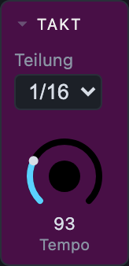

| Element | Bereich | Wirkung |
|---|---|---|
| **Teilung** | 1/1 · 1/2 · 1/4 · 1/8 · 1/16 | Notenwert pro Trigger |
| **Tempo** | 40–240 BPM | Grundtempo der Uhr |

Trigger-Abstand = Viertel (60/BPM) × Notenwert, `1/4` also genau ein Viertel, `1/16` ein
Viertel davon. Der Abstand ist zugleich die Bezugslänge für die
Envelope („Länge %") und den Gate-Reverb („Len").

### Metronom

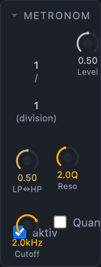

Ein eigener getakteter Klick mit Multimode-Filter (SVF). Wo er in die Kette einspeist,
bestimmt seine Position in der [Kette](#5-die-kette).

| Element | Bereich | Wirkung |
|---|---|---|
| **aktiv** | – | Metronom an/aus. Aus = alle folgenden Regler ausgeblendet |
| **l** / **m** | je 1–16 | Klick-Periode = ein Viertel × (l⁄m). `1/1` = Viertel, `1/3` = Triolen, `3/2` = punktiert |
| **Level** | 0–1 | Pegel des Klicks |
| **LP↔HP** | 0–1 | Filter-Morph: 0 = Tiefpass · 0.5 = Bypass · 1 = Hochpass |
| **Cutoff** | 50 Hz–18 kHz | Grenzfrequenz (nur bei ausgeschaltetem Quant) |
| **Quant** | – | Bindet die Grenzfrequenz an die Base-Frq statt an Hertz |
| **Band** | 20 Hz–9 kHz | Ersetzt bei Quant den Cutoff: die Base-Frq wird ins Band `L…2L` gefaltet |
| **Reso** | 0.1–20 Q | Resonanz |

### Skaler

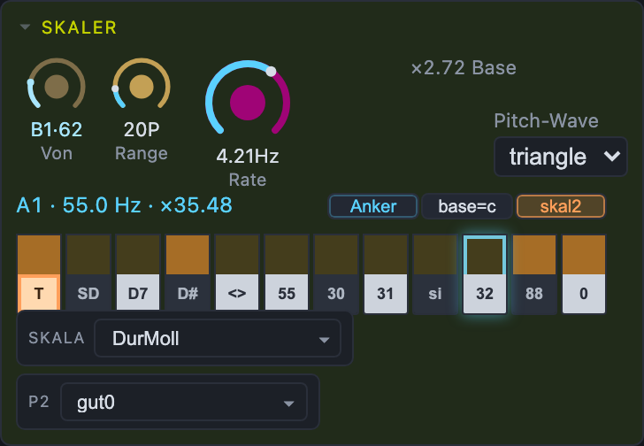

Der Skaler erzeugt die Tonhöhen: eine Wellenform läuft mit **Rate**, wird bei jedem
Trigger abgetastet und auf die erlaubten Töne gezogen.

| Element | Bereich | Wirkung |
|---|---|---|
| **Pitch-Wave** | sine · saw · triangle · random | Form der Tonhöhen-Quelle |
| **Seed** | 1–999 | Nur bei `random`: gleicher Seed = gleiche Tonfolge (reproduzierbar) |
| **Rate** | 0.05–100 Hz | Geschwindigkeit der Quelle. Nahe der Trigger-Rate entstehen stehende Muster, weit darunter langsame Melodiebögen |
| **Von** | 20 Hz–1 kHz | Untere Grenze des Tonfensters (Anzeige: Note · Hz) |
| **Range** | 1–36 P | Größe des Fensters in Halbtönen über „Von" |
| **×… Base** | Anzeige | Rate als Vielfaches der Base-Frq |

**Keyboard** = der Skala-Editor. Die 12 Tasten sind Tonklassen (C…B, absolut nach A440);
Klick schaltet einen Ton an/aus (orange = an). Darüber wandert die klingende Note mit.
Größe und Farben stellst du per Rechtsklick ein (Tastenbreite/-höhe, Farbe der aktiven Töne).

- **Anker**: schaltet den Transponier-Modus. Die obere Reihe färbt sich blau; ein Klick
  auf einen Ton verschiebt die **ganze** Skala dorthin – das Intervallmuster bleibt.
- **base=c**: die Skala wird relativ zur Base-Frq gelesen (Index 0 = Basis = „do").
  Ändert sich die Basis, transponiert das Muster mit. Das Keyboard zeigt dann `do re mi …`.
- **skal2**: dieselben 12 Tasten werden zu 12 abrufbaren Skala-Slots. Unten (Name) =
  Slot laden, Doppelklick = umbenennen; oben schaltet weiterhin Töne an/aus und schreibt
  in den aktiven Slot zurück.
- **Skala**: die 12-Ton-Maske speichern/laden/löschen (Bedienung wie jeder Speicher,
  siehe [Speichern](#9-speichern-snapshot-skala-p2-optik-backup)).
- **P2**: alle 12 skal2-Slots zusammen als ein Bündel. Nur im skal2-Modus sichtbar.

### Base-Frq

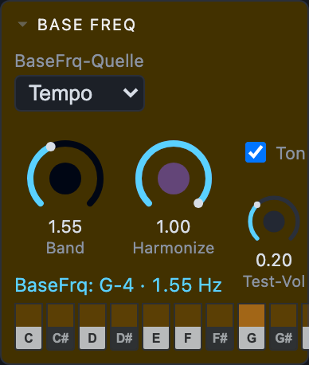

Der Bezugston. Alles, was „relativ zur Basis" arbeitet (Skala bei base=c, Harmonize,
Metronom-Quant), hängt hier dran.

| Element | Bereich | Wirkung |
|---|---|---|
| **BaseFrq-Quelle** | Freq · Tempo · Ton | Woher die Basis kommt: freie Frequenz, das Tempo selbst, oder eine Tonklasse |
| **Base-Frq** | 1–500 Hz | Nur bei Quelle `Freq`: die freie Grundfrequenz |
| **Ton** | C … B | Nur bei Quelle `Ton`: die Tonklasse (←/→ schalten sie durch) |
| **Band** | 0.05 Hz–8 kHz | Register: die Basis wird ins Band `L…2L` gefaltet. Gilt für **alle** Quellen; ↑/↓ verschieben es oktavweise |
| **Harmonize** | 0–1 | 0 = rein temperiert, 1 = voll auf ganzzahlige Vielfache der Basis |
| **Test-Ton** | – | Trockener Sinus auf der Basis, direkt am Master (umgeht die Effekte) – zum Vergleichshören |
| **Test-Vol** | 0–0.6 | Pegel des Test-Tons |
| **BaseFrq: …** | Anzeige | Note und Frequenz der tatsächlichen Basis |
| **BpM … · … Hz · P …** | Anzeige | Nur bei Quelle `Freq`: dieselbe Basis in drei Lesarten |
| **Keyboard** | – | Bei Quelle `Ton` wählst du hier die Tonklasse – immer genau eine, ein neuer Ton löst den alten ab. Bei den anderen Quellen ist es eine Anzeige: du siehst, auf welchem Ton die eingestellte Frequenz landet |

### Audio-Osz

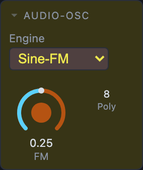

| Element | Bereich | Wirkung |
|---|---|---|
| **Engine** | Square-PW · Sine-FM | Klangerzeuger: Puls mit Pulsweite oder Sinus mit Feedback-FM |
| **PW** | 0.01–0.99 | Nur bei Square-PW: Pulsweite (0.5 = Rechteck) |
| **FM** | 0–1 | Nur bei Sine-FM: Feedback – vom Sinus Richtung Sägezahn |
| **Poly** | 1–8 | Wie viele Trigger gleichzeitig klingen dürfen. Bei langer Envelope überlappen sie sich; über der Grenze wird die älteste Stimme sanft gestohlen |

### Filter

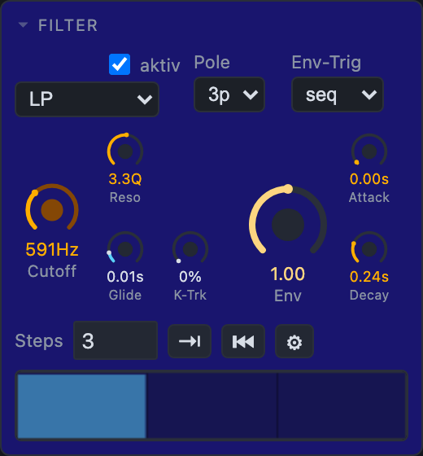

| Element | Bereich | Wirkung |
|---|---|---|
| **aktiv** | – | Filter an/aus (aus = Bypass) |
| **Typ** | LP · HP · BP · Ladder-org | Charakteristik. `Ladder-org` ist der SVF-Tiefpass-Kern (fest 4-polig, stabil) |
| **Pole** | 1p–4p | Steilheit |
| **Env-Trig** | off · each · seq | Wann die Filter-Hüllkurve auslöst: gar nicht · bei jedem Trigger voll · gesteuert vom Sequenzer |
| **Cutoff** | 20 Hz–18 kHz | Grund-Grenzfrequenz |
| **Reso** | 0.1–20 Q | Resonanz (bei LP erst ab 2p wirksam, deshalb dort sonst ausgeblendet) |
| **Env** | −1 … +1 | Hub der Hüllkurve auf den Cutoff (bis ±6 Oktaven) |
| **Attack** | 0–8 s | Anstiegszeit der Filter-Hüllkurve |
| **Decay** | 0.005–16 s | Abfallzeit; zwischen Triggern läuft sie frei aus |
| **KeyTrack** | 0–100 % | Wieviel die gespielte Frequenz den Cutoff mitzieht |
| **Glide** | 0–1 s | Wie schnell der Cutoff Tonsprüngen folgt (0 = hart) |
| **Step-Sequenzer** | – | Nur bei Env-Trig `seq`: pro Step Trigger an/aus + Env-Tiefe |

Cutoff und Hüllkurve arbeiten multiplikativ übereinander – Keytrack und Env kommen sich
also nicht in die Quere.

### Distortion

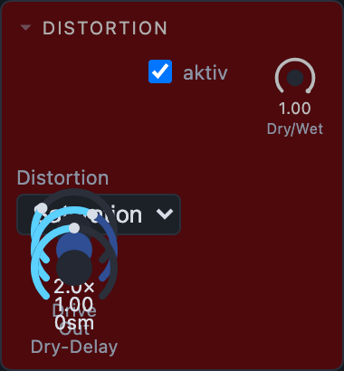

| Element | Bereich | Wirkung |
|---|---|---|
| **aktiv** | – | Distortion an/aus (aus = Bypass; nur Dry/Wet bleibt sichtbar) |
| **Distortion** (Menü) | Saturation · Hard Clip · Foldback | Kennlinie |
| **Drive** | 0.5–50 × | Vorverstärkung in die Kennlinie |
| **Out** | 0–2 | Ausgangspegel |
| **Dry/Wet** | 0–1 | Mischung |
| **Dry-Delay** | −512 … +512 sm | Versatz zwischen trockenem und verzerrtem Zweig in Samples. >0 = dry später, <0 = wet später. Bei 48 kHz sind ±512 Samples etwa ±10 ms – Kammfilter-Gebiet |

### Envelope

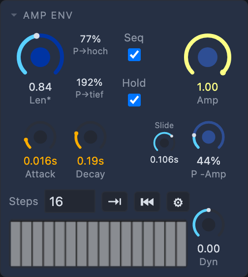

Die Amp-Hüllkurve ist ein **ASR**: Attack → volles Amp bis zum Ende der Länge → Release.
Kein Sustain-Level; die Note hält bis zum Len-Ende auf vollem Pegel.

| Element | Bereich | Wirkung |
|---|---|---|
| **Seq** | – | Amp-Sequenzer an/aus (Gate + Velocity pro Step) |
| **Hold** | – | Die Hüllkurve wird nicht neu getriggert, solange die laufende Note über den nächsten Trigger hinausreicht – der Ton klingt durch |
| **Slide** | 0–1 s | Nur bei Hold: wie lange die gehaltene Stimme braucht, um die neue Tonhöhe zu erreichen (0 = harter Sprung) |
| **Attack** | 0–0.05 s | Anstieg |
| **Release** | 0–16 s | Ausklingzeit **nach** dem Len-Ende |
| **Länge %** | 0.05–16 | Notenlänge als Anteil des Trigger-Intervalls (>1 = länger als der Abstand → Überlappen) |
| **P→Len tief** | 1–200 % | Längenfaktor für die tiefste Tonhöhe im Fenster (100 % = neutral) |
| **P→Len hoch** | 1–200 % | Längenfaktor für die höchste Tonhöhe |
| **P→Amp** | 0–100 % | Dämpft hohe Töne: 0 % = kein Einfluss, 100 % = Pegel läuft linear von 1 (tiefster Ton) auf 0 (höchster) |
| **Amp** | 0–1 | Pegel der Stimmen |
| **Dyn** | −1 … +1 | Dynamik-Kurve der Sequenzer-Velocity: 0 = linear |
| **Step-Sequenzer** | – | Pro Step Gate (aus = kein Trigger) + Velocity |

### Gate Reverb

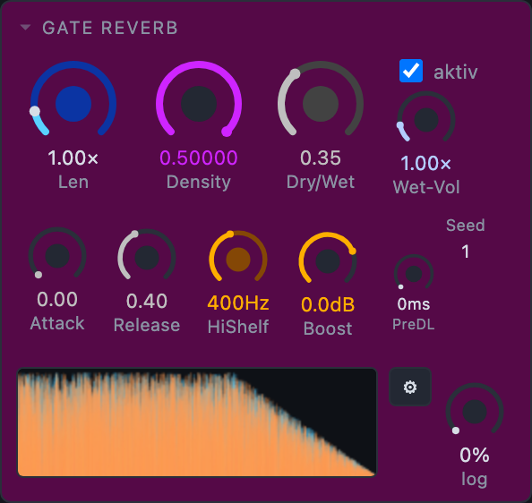

Ein getakteter Hall: die Hall-Wolke ist an das Trigger-Intervall gekoppelt statt an eine
feste Nachhallzeit.

| Element | Bereich | Wirkung |
|---|---|---|
| **aktiv** | – | Reverb an/aus (aus = Bypass; nur Dry/Wet bleibt sichtbar) |
| **Dry/Wet** | 0–1 | Mischung |
| **Wet-Vol** | 0–4 × | Pegel des Hall-Anteils („Gas geben") |
| **Density** | 0–1 | Dichte der Reflexionen |
| **Len** | 0–16 × | Länge der Wolke relativ zum Trigger-Intervall |
| **Attack** | 0–1 | Einschwing-Anteil am Anfang der Reflexionen (0 = sofort voll) |
| **Release** | 0–1 | Ausfade-Anteil am Ende (0 = hartes Gate) |
| **Rel-Form** | 0–100 % | Form des Ausklangs: 0 = linear, 100 = „logarithmisch" (schneller Anfangsabfall, langer Schwanz) |
| **HiShelf** | 40 Hz–8 kHz | Grenzfrequenz des Shelf-Filters auf dem Hall |
| **Boost** | −18 … +6 dB | Anhebung/Absenkung darüber (0 = neutral) |
| **Pre-Delay** | 0–200 ms | Verzögerung vor den Reflexionen |
| **Seed** | 1–999 | Zufalls-Startwert der Wolke: gleiche Zahl = gleiche Wolke |
| **Reflections-Anzeige** | – | Bild der Wolke (beide Kanäle); Rechtsklick stellt Größe und Kanalfarben ein |

### Debug

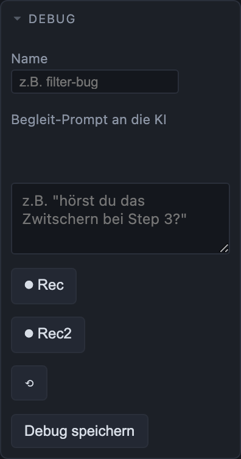

Kein Klang-Werkzeug, sondern eins zum Berichten: es bündelt auf Klick Audio, Bild,
Zustand und einen Begleittext zu Dateien, die man einer KI hinlegen kann.

| Element | Wirkung |
|---|---|
| **Name** | Dateiname des Bündels (`teslacoil_debug_<name>.*`) |
| **Text** | Begleit-Prompt, z. B. „hörst du das Zwitschern bei Step 3?" |
| **Rec** / **Rec2** | Zwei Aufnahmen zum Vergleich (vorher/nachher). Abgegriffen wird parallel am Master, der Hörweg bleibt unberührt. Der Knopf zeigt, was er tut: **⏺** = bereit (mit Länge der letzten Aufnahme), **⏹ + rot** = nimmt gerade auf. **Nie laufen beide gleichzeitig** – startest du den einen, stoppt der andere und behält seinen Take. Ein neuer Start verwirft die vorherige Aufnahme *dieses* Recorders |
| **Debug speichern** | Lädt einzeln herunter: Audio (WAV, beide Aufnahmen), Screenshot (PNG), Zustand (JSON), Prompt (TXT) |

---

## 7. Anzeigen

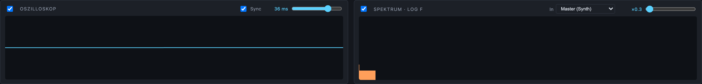

- **Oszilloskop** (Zeit): Haken links = Anzeige an/aus (aus spart CPU). **Sync** rastet auf
  die steigende Nullflanke, das Bild steht still. Der Regler rechts stellt den
  Zeitausschnitt ein (Anzeige in ms).
- **Spektrum · log f**: logarithmische Frequenzachse. **In** wählt die Quelle: Master
  (Synth) oder ein Audio-Eingang/Mikrofon – damit lässt sich eine echte Spule mit dem
  Synth vergleichen. Der Regler rechts ist der reine Anzeige-Pegel (×0.1–…), er ändert
  den Klang nicht.

---

## 8. Anordnen (e-Mode) und Optik

Taste **e** (oder **⇄** in der Kopfzeile) schaltet den Anordnen-Modus. Das Panel
schraffiert sich, die Bedienung ist stillgelegt, alle Controls werden sichtbar – auch die
gerade ausgeblendeten:

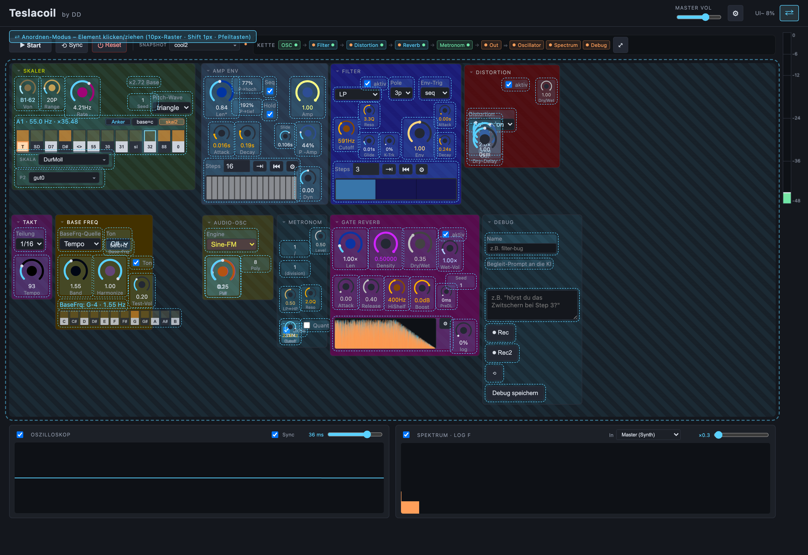

- **Alles ist einzeln verschiebbar**: Regler, Menüs, Schalter, Sequenzer, Keyboard,
  Anzeigen, Texte.
- **Raster 10 px**, **Shift** = 1 px fein. Ein per Shift gesetzter Versatz bleibt erhalten,
  wenn danach wieder im Raster geschoben wird.
- **Klick wählt aus** (orange), mehrere Elemente gehen zusammen; die **Pfeiltasten**
  bewegen die Auswahl (Shift = 1 px). **Esc** hebt sie auf.
- **Ganze Gruppen** zieht man am Titel – gleiches Raster, gleiche Tasten.
- Sobald in einer Gruppe etwas bewegt wird, wird sie zum freien Canvas: der Rahmen
  umschließt danach exakt die belegte Fläche.

Nochmal **e** (oder ⇄) und der Spielbetrieb ist zurück. Die Anordnung wird als Optik
automatisch gesichert.

**Gruppen-Einstellungen** (Rechtsklick auf die Gruppe):

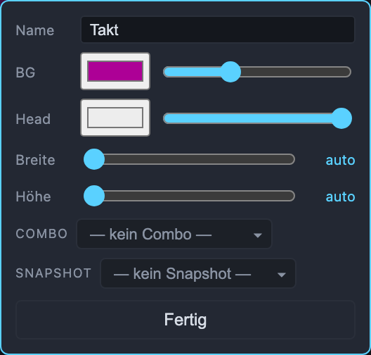

| Feld | Wirkung |
|---|---|
| **Name** | Beschriftung der Gruppe (frei umbenennbar) |
| **BG** / **Head** | Hintergrund- und Titelfarbe, je mit Deckkraft-Regler |
| **Breite** / **Höhe** | feste Maße, `auto` = am Inhalt |
| **Combo** | Farbkombination speichern und auf andere Gruppen anwenden |
| **Snapshot** | Klang-Speicher **nur dieser Gruppe** (siehe unten) |

**Optik und Sound sind getrennt.** Farben, Positionen, Beschriftungen, Regler-Skalen und
Größen sind Optik; ein Snapshot-Recall fasst sie nicht an. Umgekehrt ändert ein Layout
keinen einzigen Klang-Parameter.

---

## 9. Speichern: Snapshot, Skala, P2, Optik, Backup

Alles wird laufend automatisch gesichert und beim Neuladen wiederhergestellt. Die
Speicher darüber hinaus:

| Speicher | Inhalt | Wo |
|---|---|---|
| **Snapshot** | alle Klang-Parameter | Transportzeile |
| **Gruppen-Snapshot** | die Klang-Parameter einer Gruppe | Gruppen-Einstellungen |
| **Skala** | die 12-Ton-Maske | Skaler-Gruppe |
| **P2** | alle 12 skal2-Slots zusammen | Skaler-Gruppe (im skal2-Modus) |
| **Optik/Layout** | Positionen, Farben, Beschriftungen, Regler-Skalen | automatisch |
| **Backup** | wirklich alles | Einstellungen (⚙) |

Alle diese Speicher werden gleich bedient: ein Knopf, auf dem der **geladene Eintrag
steht**, und darin die Liste. Der geladene ist markiert – bei einer langen Liste springt
sie beim Öffnen direkt zu ihm.

- **Klick auf einen Eintrag lädt ihn.** Auch auf den markierten: Verschraubt? Nochmal
  anklicken → alles wieder wie gespeichert.
- **In der Zeile** liegen die Aktionen, die genau diesen Eintrag meinen: **✎**
  überschreiben (mit dem aktuellen Zustand) · **🗑** löschen.
- **In der Fußzeile** liegt, was die ganze Liste betrifft: **＋ Neu…** speichern (gleicher
  Name = überschreiben, und es springt direkt auf den neuen Eintrag), beim Snapshot
  zusätzlich **⤓ Export** / **⤒ Import** als Datei.

### Einstellungen: Backups, Datei, Werkseinstellung

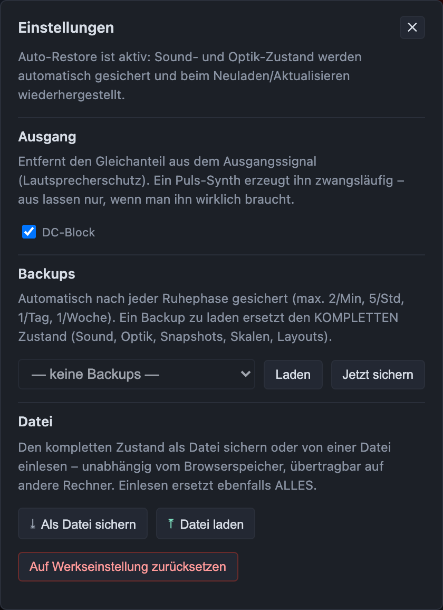

- **Ausgang – DC-Block**: Rumpel-/Gleichspannungsfilter am Ausgang (Lautsprecherschutz).
  Aus = Extreme erlaubt.
- **Backups**: vollständige Sicherungen, automatisch nach jeder Ruhephase, gestaffelt
  aufbewahrt (max. 2/Min, 5/Std, 1/Tag, 1/Woche). *Laden* ersetzt den kompletten Zustand –
  Sound, Optik, Snapshots, Skalen, Layouts. Vorher wird automatisch gesichert.
  *Jetzt sichern* legt sofort eins an.
- **Datei**: Diese Backups liegen nur im Speicher dieses Browsers – geleerter Speicher
  oder ein anderer Rechner, und sie sind weg. *Als Datei sichern* schreibt den kompletten
  Zustand als JSON heraus, *Datei laden* liest ihn zurück (ersetzt ebenfalls alles).
- **Auf Werkseinstellung zurücksetzen**: lädt die ausgelieferte Werkseinstellung –
  dieselbe, die ein neuer Besucher bekommt. Zwei Rückfragen, und vorher wird automatisch
  ein Backup angelegt.

> Die Werkseinstellung kommt **nur beim allerersten Besuch**. Ein Reload – auch ein
> harter – überschreibt eine eigene Arbeit nie.

---

## 10. Tastatur-Spickzettel

| Taste / Geste | Wirkung |
|---|---|
| **Leertaste** | Start / Stop |
| **Esc** | Overlays zu, Auswahl weg, Fokus abgeben |
| **e** | Anordnen-Modus an/aus |
| **Tab / Shift+Tab** | im Kreis durch die Bedienelemente eines Panels |
| **↑ / ↓** | Base-Frq-Band oktavweise (×2 / ÷2) |
| **← / →** | Base-Tonklasse (nur bei Quelle `Ton`) |
| **Pfeiltasten** (e-Mode) | ausgewähltes Element schieben – 10 px, mit Shift 1 px |
| **Regler ziehen** | Wert ändern · Doppelklick = eintippen · Rechtsklick = Einstellungen |
| **Rechtsklick** | Einstellungen des Elements bzw. der Gruppe |

Nur echte Texteingaben schlucken diese Tasten; alles andere gibt sie an das Instrument
weiter, auch wenn es gerade den Fokus hat.

---

Die Bilder dieser Anleitung erzeugt `python3 test/shots.py` neu.

Viel Spaß – und nicht die Finger an die echte Spule. ⚡
